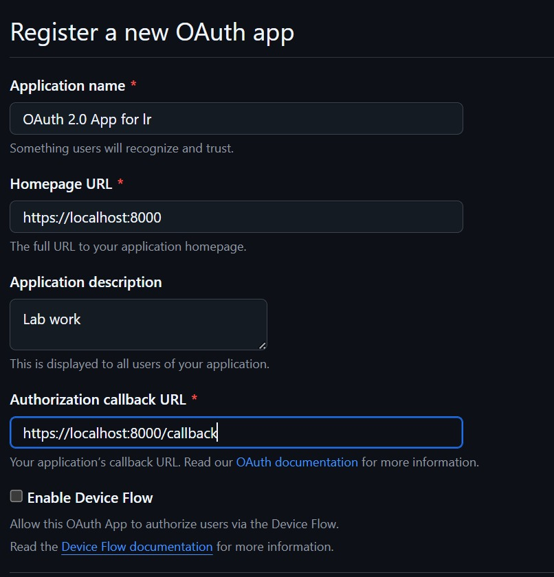

# Лабораторная работа: практика OAuth 2.0 в Python

## Цели

* Познакомиться с концепциями OAuth 2.0 — роли участников, типы токенов, scopes.
* Реализовать поток Authorization Code в Python с использованием библиотеки requests‑oauthlib.
* Получить и использовать access token для обращения к защищённому ресурсу.
* Опционально: изучить поток Client Credentials и механизм обновлен

---

## Теоретические Сведения

**OAuth 2.0** — это протокол делегирования доступа, который позволяет приложению (Клиенту) получать доступ к ресурсам пользователя (Resource Owner) без прямого ввода его логина и пароля.

**Ключевые роли:**
* **Resource Owner:** Пользователь, владеющий данными.
* **Client:** Приложение, запрашивающее доступ.
* **Authorization Server:** Проверяет пользователя и выдает токены.
* **Resource Server:** Хранит данные и принимает Access Token.

**Authorization Code Flow:** Самый безопасный поток, где Клиент получает временный **Код Авторизации** через браузер, а затем обменивает его на **Access Token** через **защищенное серверное соединение** (back-channel).

---

## Ход Работы и Результаты

### Подготовка и Настройка Приложения

1.  **Настройка среды:** Установлены Python и библиотека `requests-oauthlib`. Учетные данные (`CLIENT_ID` и `CLIENT_SECRET`) установлены как переменные окружения.
2.  **Конфигурация URI:** Для обеспечения безопасности и соответствия стандарту OAuth 2.0 был установлен следующий URI: `REDIRECT_URI = "https://localhost:8000/callback"`.

### Задание 1: Выполнение Authorization Code Flow

Процесс был запущен с помощью скрипта `oauth_client.py`.

**Скриншот процесса обмена и доступа:**
 

---
## Задание 2: Обновление Токена (Refresh Token)

Целью данного задания было реализовать механизм получения **Refresh Token** для обеспечения долгосрочного доступа к API Google, не требуя повторной авторизации пользователя после истечения срока действия **Access Token**.

### Настройка и ключевой параметр

1.  **Настройка:** Были установлены специализированные библиотеки Google Auth (`google-auth-oauthlib`) и зарегистрировано новое OAuth-приложение в Google Cloud Console. Скачан файл client_secret.json, который в целях безопасности не был добавлен в репозиторий.
2.  **Ключевой момент:** Для получения Refresh Token в URL авторизации был явно указан параметр: `access_type='offline'`.

**Результат обмена токенами (JSON-ответ):**

## Ответы на Контрольные Вопросы

### 1. Роли в протоколе OAuth 2.0
Основные роли:
* **Resource Owner** — пользователь, владеющий данными;
* **Client** — приложение;
* **Authorization Server** — сервер для аутентификации;
* **Resource Server** — сервер, хранящий защищенные ресурсы.
1) Client перенаправляет Resource Owner на Authorization Server с параметрами (client_id, redirect_uri, scope, state). 
2) Resource Owner аутентифицируется и дает согласие. 
3) Authorization Server возвращает authorization code на redirect_uri. 
4) Client обменивает код на access token (и refresh token), используя client_secret. 
5) Client использует access token для доступа к Resource Server.

### 2. Что такое Authorization Code и зачем он нужен?
**Authorization Code** — это временный, одноразовый код, выдаваемый сервером авторизации. Он используется для безопасного обмена на Access Token через прямое серверное соединение, что исключает возможность перехвата самого токена в незащищенном браузере.

### 3. Почему параметр state важен в запросе на авторизацию?
Параметр **`state`** важен для **предотвращения CSRF-атак**. Клиент генерирует уникальное случайное значение `state` и отправляет его в запросе. Сервер авторизации возвращает это же значение. Клиент проверяет совпадение.

### 4. Чем отличается Authorization Code Flow от Client Credentials Flow?
| Поток | Цель | Участие Пользователя |
| :--- | :--- | :--- |
| **Authorization Code** | Делегирование доступа к **ресурсам пользователя**. | **Обязательно** (аутентификация и согласие). |
| **Client Credentials** | Доступ к **ресурсам самого Клиента** (сервис-в-сервис). | **Отсутствует**. |

### 5. В каких случаях используется refresh token и какова его роль?
**Refresh token** —  это долгоживущий, используется для обновления access token без повторного входа (если access token истек). 

---
